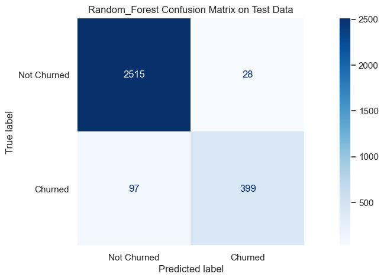

# Predict Customer Churn

## Project Overview

- Project **Predict Customer Churn** for ML DevOps (MLOps) Engineer Nanodegree at Udacity

### Project Approach

This project, part of Udacity's Machine Learning DevOps Engineer Nanodegree, focuses on producing production-ready clean code following best practices. The main objective is to predict customer churn for banking customers, a classification problem.

The project follows these steps:
- Exploring a dataset with over 10,000 samples (EDA)
- Preparing data for training
- Training two classification models (sklearn random forest and logistic regression)
- Identifying the most important features influencing predictions and visualizing their impact using SHAP library
- Saving the best models along with their performance metrics

### Code Quality

The script file (`.py`) has been adjusted to adhere to the PEP8 standard using the autopep8 module. It also scores above 8.0 using pylint for clean code.

## Files and Data Description

#### Directory Structure

The project directory is organized as follows:
- Folders
    - Data
        - eda       --> contains output of the data exploration
        - results   --> contains the dataset in csv format
    - images        --> contains model scores, confusion matrix, ROC curve
    - models        --> contains saved models in .pkl format
    - logs          --> log generated during testing of library.py file

- Project Files 
    - churn_library.py
    - churn_notebook.ipnyb
    - requirements.txt

- Pytest Files (Unit Test File and Configuration Files)
    - test_churn_script_logging_and_tests.py  
    - pytest.ini    
    - conftest.py

## Running the Project

- The project should be executed with Python 3.8 and the appropriate Python packages.
- Required packages are listed in the `requirements.txt` file.
- To run the project, execute the script `python churn_library.py` from the project folder.
- Alternatively, the project can be executed using the Jupyter notebook for a step-by-step approach.
- The project script `churn_library.py` was tested using the pytest Python package.
    - To run the unit tests, simply type `pytest` from the main project folder in the command line.
    - Project functions will be automatically tested with a log file generated in the logs folder.

## Classification Performance

Random Forest achieves the best performance on the test set:
- Superior ROC curve:

- Strong confusion matrix, although still generating false negatives which could be an issue given our objective to detect churn likelihood:

The influence of each feature on the prediction of churn can be visualized using the SHAP module (features pushing towards churn to the right of the y-axis):

