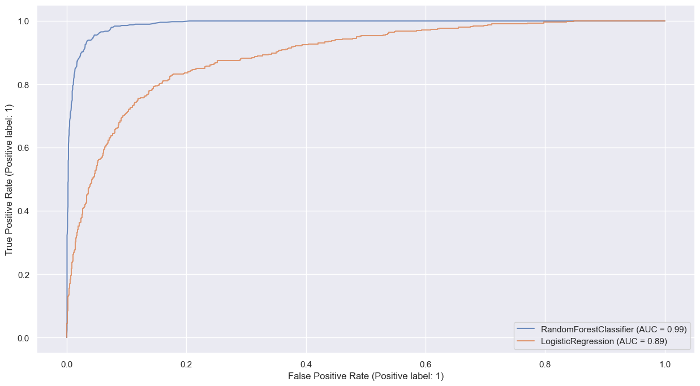
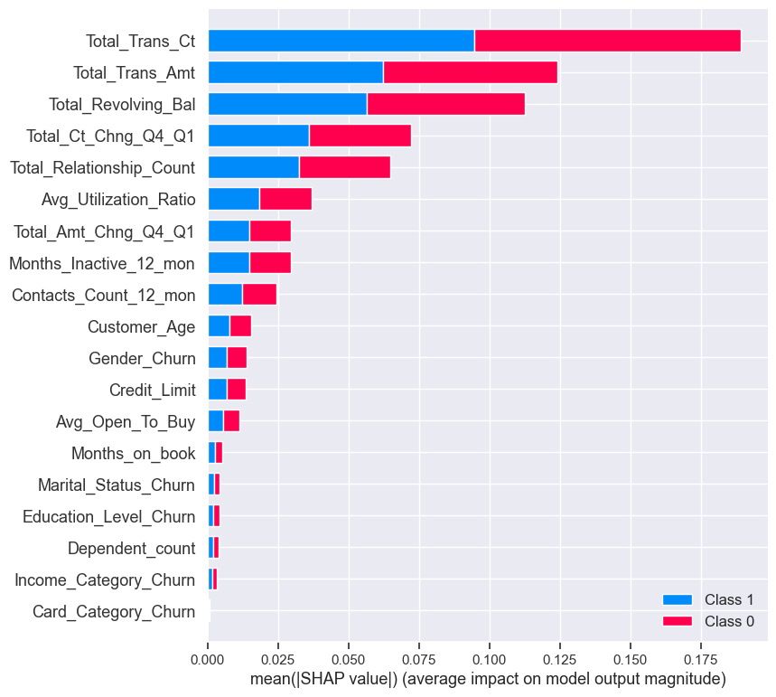

# Predict Customer Churn

## Project Overview

- Project **Predict Customer Churn** for ML DevOps (MLOps) Engineer Nanodegree at Udacity

### Project Approach

This project, part of Udacity's Machine Learning DevOps Engineer Nanodegree, focuses on producing production-ready clean code following best practices. The main objective is to predict customer churn for banking customers, a classification problem.

The project follows these steps:
- Exploring a dataset with over 10,000 samples (EDA)
- Preparing data for training
- Training two classification models (sklearn random forest and logistic regression)
- Identifying the most important features influencing predictions and visualizing their impact using SHAP library
- Saving the best models along with their performance metrics

### Project Structure

The project directory is organized as follows:

- Folders
    - data\ 
        - `bank_data.csv` : contains the dataset in csv format
    - images\
        - `eda\` : contains output of the data exploration
        - `results\` : contains model scores, confusion matrix, ROC curve 
    - models\ : contains saved models in .pkl format
    - logs\ : log generated when running `python test_churn_script_logging_and_tests.py` file

- Project Files : 
    - `churn_library.py` : This file serves the purpose of documenting modeling functions, encompassing tasks such as data retrieval, exploratory data analysis (EDA), feature engineering (including one-hot encoding, standardization, and data partitioning), as well as the execution of modeling tasks using logistic regression and random forest (including training, prediction, and evaluation).
    - `test_churn_script_logging_and_tests.py` : This file is utilized for testing and logging the workflow of modeling as documented in the `churn_library.py` file.
    - `churn_notebook.ipnyb`: notebook provided by udacity ( I did some minor adjustment for styling only)
    - `churn_notebook_solution.ipnyb`: a notebook solved by utilizing `churn_library.py` functionality 
    - `requirements_py38.txt` : python framworks for the project. 

## Running the Project

- The project should be executed with Python 3.8 and the appropriate Python packages.
- Required packages are listed in the `requirements_py38.txt` file, run `pip install -r requirements_py38.txt` .
- To run the project, execute the script `python churn_library.py` from the project folder.
- Alternatively, the project can be executed using the Jupyter notebook for a step-by-step approach by importing `churn_library` , check  `churn_notebook_solution.ipnyb` .

### Code Quality
both scripts (`churn_library.py`) & (`churn_script_logging_and_tests.py`) have been adjusted to adhere to the PEP8 standard using the autopep8 module. 
the twos scrips scored above 8.0 based on pylint for clean code.

to test the scores, run `pylint churn_library.py` , `pylint churn_script_logging_and_tests.py`

- The project script `churn_library.py` was tested using the pytest Python package.
    - To run the unit tests, simply run `pytest` from the main project folder in the command line.
    - To generate test and generate the log files you can run `python test_churn_script_logging_and_tests.py` .

## Modeling performance

Random Forest achieves the best performance on the both training and test sets:

- Classification report:

- ROC curve for both models:

The influence of each feature on the prediction of churn can be visualized using the SHAP module, below is the SHAP model for the randomforest classifier :

